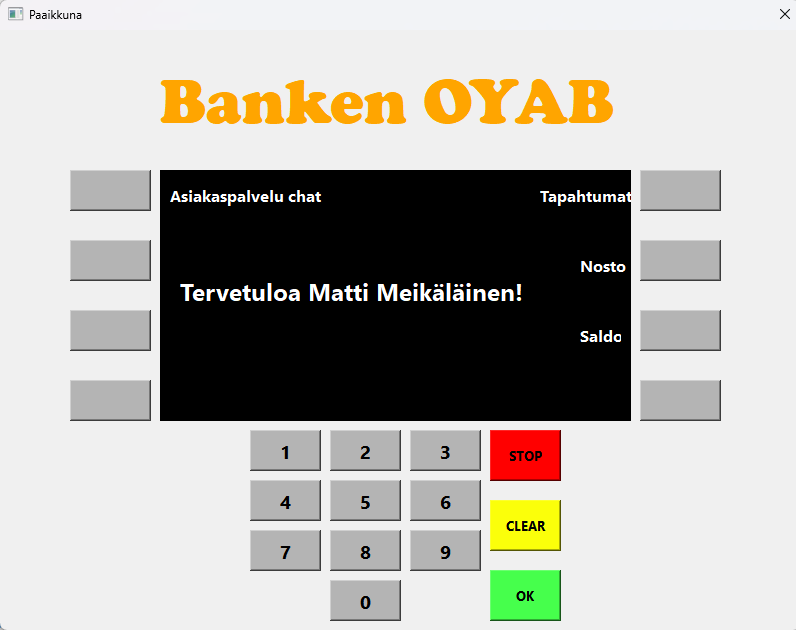
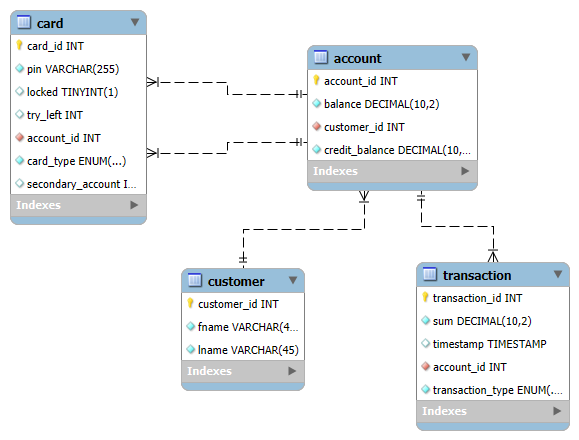
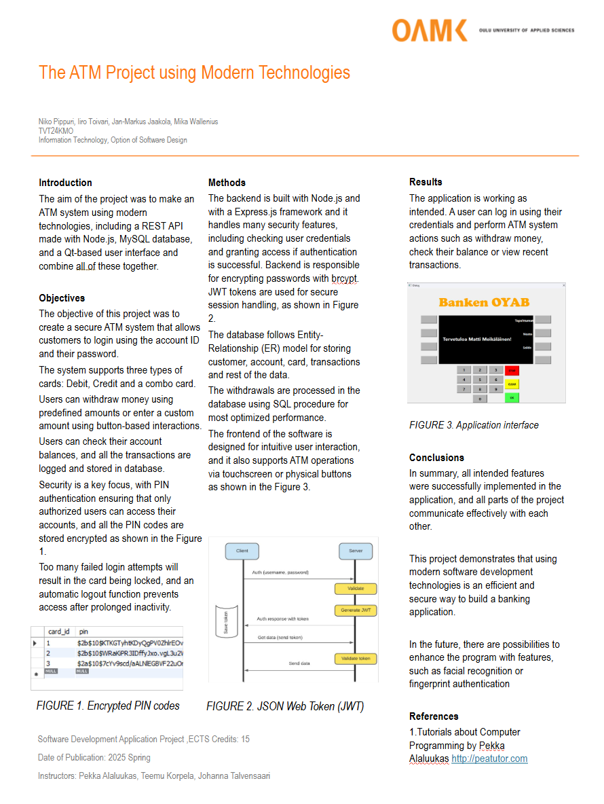
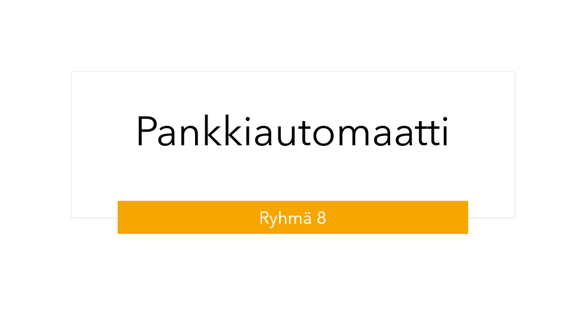

# Project: Banking System - **Banken OYAB**



## Table of Contents

- [About the Project](#about-the-project)

- [Features](#features)

- [Technologies Used](#technologies-used)

- [Setup](#setup)

- [Usage](#usage)

- [Database ER model](#database-er-model)

- [Poster](#poster)

- [Presentation](#presentation)

- [Contributors](#contributors)

- [License](#license)


## About the Project
This school project simulates a ATM system using modern technologies, including a REST API, a MySQL database, and a Qt-based user interface

## Features
### Basic features
- User can login with card id ja pin code.
- View account balance.
- Withdraw fixed amounts (20, 40, 50, 100 EUR).
- Check transaction history (last 10 transactions).

### Advanced features
- Card lock after 3 incorrect PIN attempts.
- Logout timer after 10 seconds of inactivity.


## Technologies Used 

- **Frontend**: A desktop application built with Qt that communicates with the REST API.
- **Backend**: REST API built with Node.js and Express.js to handle business logic and database communication.
- **Database**: MySQL for storing user and account data.
- **Security**: brycpt for pin code encryption

## Setup
1. Clone the repository:
   ```bash
   git clone https://github.com/tvt24kmo-project/group_8.git
   cd group_8
   ```
2. Set up the database:
   - Import the provided SQL schema and test data.
3. Install backend dependencies:
   ```bash
   cd backend && npm install swagger-ui-express swagger-jsdoc
   ```
4. Run the backend:
   ```bash
   npm start
   ```
5. Set up and run the Qt application.

## Usage
- Launch the Qt application and log in using your card's ID ja enter correct PIN.
- Use the available features to view your balance, withdraw money, and view transaction history.

## Database ER model


## Contributors
- **Niko Pippuri**
- **Jan-Markus Jaakola**
- **Iiro Toivari**
- **Mika Wallenius** 

## Poster
[](images/group_8_english_poster.pdf)

## Presentation

<a href="images/Project_presentation.pptx">
    
</a>


## License
This project is licensed under the MIT License. See the `LICENSE` file for details.
